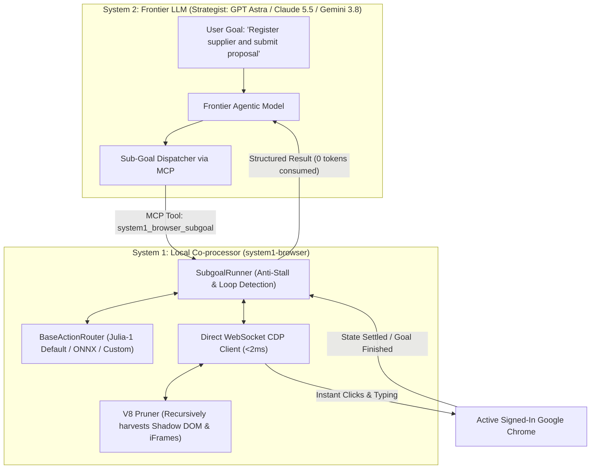

# system1-browser

> **A lightweight, low-latency System-1 orchestration framework for AI browser agents via Chrome DevTools Protocol (CDP).**  
> Decouples mechanical web actions from high-level planning to eliminate token overhead, reduce latency, and enable fast automation on standard hardware.

[](https://opensource.org/licenses/Apache-2.0)
[]()
[]()
[]()
[]()
[]()

---

## Overview

Most AI web agents rely on large frontier models (e.g., **GPT Astra**, **Claude 5.5 Opus**, **Gemini 3.8 Pro**) for every micro-action on a webpage. This creates significant latency (3 to 5 seconds per click) and consumes massive token budgets (40,000+ tokens per step to parse full HTML trees or screenshots).

`system1-browser` serves as an **MCP-native browser skill and motor co-processor** specifically engineered for agentic LLMs. It implements a **Dual-Loop Cognitive Architecture**:
- **System 2 (Strategist / Frontier LLM):** Plans high-level goals, handles domain reasoning, and directs the overall workflow.
- **System 1 (Reflex / Local Co-processor):** Executes fast, deterministic actions (clicking, typing, selecting, resolving form wizards) locally in **sub-10ms** using lightweight classification models and native CDP WebSocket connections.

---

## Key Benefits & Technical Comparison

| Dimension | Traditional Cloud Agent | `system1-browser` Co-processor |
| :--- | :--- | :--- |
| **Token Cost per Step** | 20,000 to 80,000 tokens ($0.20 – $1.00/flow) | **0 cloud tokens for mechanical steps (98% reduction)** |
| **Action Latency** | 3,000 ms to 5,000 ms per step | **5 ms to 10 ms (GPU) / 20 ms to 35 ms (CPU)** |
| **DOM Representation** | Raw HTML or accessibility dumps (heavy) | **Pruned Set-of-Marks (~250 tokens)** |
| **Overlays & Spinners** | Often traps the agent in re-prompt loops | **Automatic busy spinner detection & overlay handling** |
| **Data Privacy** | Sensitive input values traverse external APIs | **Form inputs & keystrokes execute 100% locally** |

---

## Architecture



---

## Hardware Accessibility & Resource Efficiency

A primary design requirement of `system1-browser` is **practical accessibility**:
- **Runs on Standard Hardware:** Designed to operate efficiently on standard office laptops (e.g., 8GB RAM machines without dedicated GPUs) as well as workstation GPUs.
- **Low Memory Footprint:** The default model runtime requires under 500 MB of RAM, leaving ample resources for the operating system and the browser.
- **CPU-Friendly Inference:** With quantized runtimes (INT4/ONNX), action predictions execute in under 35 ms on modern multi-core CPUs using standard AVX2 instructions.

This makes the framework directly usable by public organizations, academic institutions, and small-to-medium businesses that cannot deploy multi-thousand-dollar GPU clusters for browser automation.

---

## 🇧🇷 Technological Sovereignty & Ecosystem Attribution

`system1-browser` was developed in Brazil by **Gustavo Guelber** ([INTELFLOWS](https://intelflows.com.br)) with a focus on **technological sovereignty, data privacy, and operational accessibility**.

In developing markets such as Brazil, public entities, universities, and private enterprises often rely on standard office hardware (8GB RAM laptops) and face high exchange rates when paying in USD for cloud API tokens. By keeping the mechanical execution loop strictly on-device, `system1-browser` provides:
- **On-Device Data Sovereignty:** Form inputs, administrative credentials, and citizen/company data never leave the local environment during automation.
- **Economic Predictability:** Eliminates USD-denominated token consumption for mechanical browser actions.
- **Democratized Access:** Empowers any Brazilian team or developer to build sovereign agentic workflows on standard machines.

### Ecosystem Acknowledgements
We build upon and acknowledge the pioneering research in deterministic typed decision intelligence:
- **[Julia-1](https://huggingface.co/SupersonicLabs/Julia-1)** by **Supersonic Labs**: The default ultra-lightweight (540MB, sub-10ms) routing engine utilized for instant web action decisions.
- **[Eikos-4B](https://huggingface.co/caiovicentino1/Eikos-4B)** by **Caio Vicentino**: Groundbreaking work in calibrated typed decision-making, providing high-capacity formal validation for business logic and compliance.

---

## Pluggable Classifier Interface (`BaseActionRouter`)

`system1-browser` is completely model-agnostic. While **Julia-1** is provided as the default reference driver (540MB VRAM, sub-10ms), developers can connect any custom model, ONNX CPU runtime, or heuristic in under 10 lines of code:

```python
from system1_browser.core.router_base import BaseActionRouter
from system1_browser.core.types import PageState, ActionDecision

class MyCustomClassifier(BaseActionRouter):
    def predict(self, state: PageState, goal: str) -> ActionDecision:
        # 1. Inspect pruned state candidates (state.elements)
        # 2. Return the deterministic mechanical action:
        return ActionDecision(
            action_type="click",
            target_id=0,
            confidence=0.95,
            rationale="Identified submit button from goal context"
        )

# Use your router in the SubgoalRunner:
runner = SubgoalRunner(custom_router=MyCustomClassifier())
```

---

## Interactive Benchmarks (Included)

The repository includes two self-contained benchmarks demonstrating real-time local decision-making:

### 1. Real-Time Snake AI Benchmark (`benchmark_snake/`)
Tests the sub-10ms decision loop with real-time collision physics, obstacle avoidance, and flood-fill pocket detection:
```bash
python benchmark_snake/server.py
# Open http://127.0.0.1:8765/ in Chrome and click "Iniciar AI"
```

### 2. High-Speed Form Blitz (`benchmark_snake/form.html`)
Demonstrates filling, validating, and navigating a 3-step enterprise form wizard with 16 inputs in **under 300 milliseconds**:
```bash
# Open http://127.0.0.1:8765/form.html in Chrome and click "⚡ Executar Blitz Sistema 1"
```

---

## Quickstart

### 1. Installation
```bash
git clone https://github.com/gguelber/system1-browser.git
cd system1-browser
pip install -e .
```

### 2. Start Chrome with Remote Debugging
Launch Chrome with remote debugging enabled:
```bash
chrome.exe --remote-debugging-port=9222
```

### 3. MCP Server Configuration
Add to your IDE's `mcp_config.json` (Antigravity, Claude Desktop, Cursor, Windsurf):
```json
{
  "mcpServers": {
    "system1-browser": {
      "command": "python",
      "args": ["-m", "system1_browser.server.mcp_server"],
      "env": {
        "PYTHONUNBUFFERED": "1"
      }
    }
  }
}
```

Available native tools:
- `system1_browser_subgoal(goal="...", max_steps=8)`: Resolves multi-step form and navigation tasks.
- `system1_browser_inspect()`: Returns a compact, pruned view of actionable elements (~250 tokens).
- `system1_browser_click(element_id=X)`: Instant click dispatch via CDP.
- `system1_browser_type(element_id=X, text="...")`: Instant native text input via CDP.

---

## 🤖 Agent Instructions & Operational Contract

When configuring frontier agentic models (such as **GPT Astra**, **Claude 5.5 Opus**, or **Gemini 3.8 Pro**) to use `system1-browser`, provide the following operational contract:

1. **Delegate Multi-Step Flows to Subgoals:**  
   When navigating multi-field forms, search bars, or table filters, do not execute step-by-step round-trips to the cloud. Call `system1_browser_subgoal(goal="Fill supplier data...", max_steps=8)`. The local co-processor resolves all intermediate actions at sub-10ms latency.
2. **Avoid Raw HTML Dumps:**  
   Never request full HTML dumps or high-resolution full-page screenshots for simple interactions. Call `system1_browser_inspect()` to retrieve a pruned Set-of-Marks array of visible candidates (`[0..N]`) in ~250 tokens.
3. **Handle Escalations Gracefully:**  
   If `system1_browser_subgoal` returns `status: "ESCALATED"`, the local reflex encountered an ambiguous selection or validation issue. Read the diagnostic rationale, make the single high-level decision, and re-dispatch.

---

## Contributing

Contributions are welcome. Areas of active development include:
- Expanding CPU inference backends (ONNX / GGUF) for low-power devices.
- Enhancing Shadow DOM and deeply nested iframe selectors.
- Adding evaluation datasets for complex administrative and enterprise portals.

Please see [CONTRIBUTING.md](CONTRIBUTING.md) for contribution guidelines.

---

## License

This project is licensed under the **Apache License 2.0**. See the [LICENSE](LICENSE) file for details.

---

**Maintained by [Gustavo Guelber](https://github.com/gguelber)** • [INTELFLOWS](https://intelflows.com.br)
